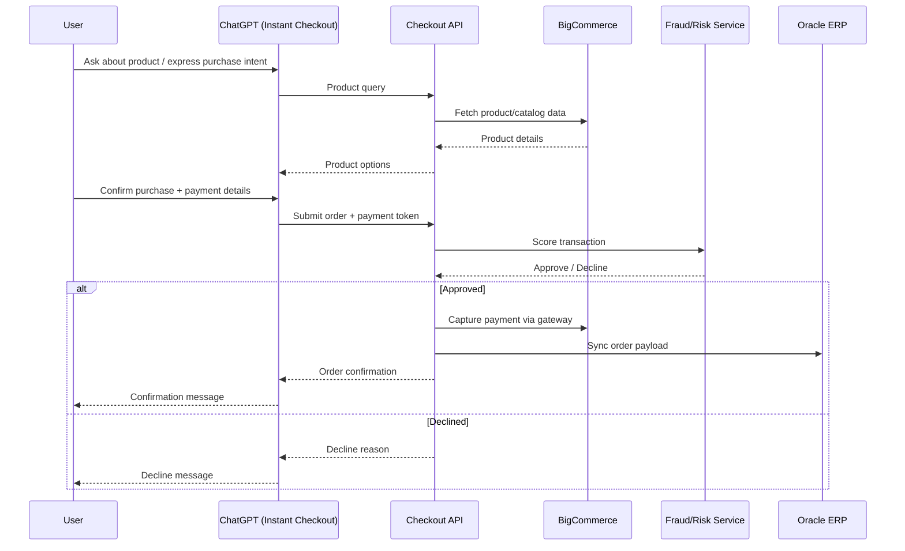

# Technical Specification: AI-Powered Conversational Checkout

## 1. Overview

Enable customers to discover and purchase products through natural-language conversations in ChatGPT, using OpenAI's Apps SDK / Instant Checkout capability. Customers can ask ChatGPT about products and complete a purchase without leaving the chat, backed by our existing BigCommerce storefront and Oracle ERP.

## 2. Goals & Success Metrics

**Goals**
- Let customers shop and check out entirely within a ChatGPT conversation.
- Reduce checkout time and friction compared to the standard web flow.

**Success Metrics**
- Increase in overall conversion rate (chat-initiated purchases vs. sessions).
- Reduction in average checkout completion time vs. baseline web checkout.

## 3. Target Users

- All customers, accessed via ChatGPT (no segment restriction for v1).
- Guest checkout supported — no existing account required.

## 4. Scope

### 4.1 MVP (3-month timeline)
- Single-product purchase flow via ChatGPT conversation (browse → select → buy one item).
- Guest checkout only (no login/SSO requirement).
- Payment collection via OpenAI Instant Checkout, tokenized and settled through our existing BigCommerce payment gateway.
- AI-based fraud/risk scoring applied to each transaction before order confirmation.
- Order payload synced to Oracle ERP for fulfillment.
- Chatbot support for checkout questions (order total, shipping options, payment issues) within the same conversation.
- Internal beta first (team + stakeholders), followed by external rollout.

### 4.2 Explicitly Out of Scope (Phase 1)
- Multi-item cart purchases via chat.
- Order status/tracking via chat.
- Returns/refunds via chat.
- Promo codes/discounts.
- Authenticated (logged-in) chat checkout — deferred to a later phase.

*(To be confirmed with stakeholders: any additional exclusions.)*

## 5. User Experience Flow

1. Customer asks ChatGPT about a product (e.g. "I need running shoes under $100").
2. ChatGPT, via the Apps SDK integration, queries product data from BigCommerce and presents options.
3. Customer selects a single item and confirms intent to purchase.
4. ChatGPT collects shipping and payment details through the Instant Checkout flow (guest checkout — no account required).
5. Transaction is sent to our backend for AI fraud/risk scoring.
   - If passed: order is confirmed, payment is captured via the BigCommerce payment gateway, and confirmation is returned to the customer in-chat.
   - If flagged: order is held/declined per risk policy (see [8. Risk & Compliance](#8-risk--compliance)).
6. Order payload is synced to Oracle ERP for fulfillment.
7. Customer can ask follow-up questions (e.g. shipping cost, payment errors) and the chatbot responds using order/session context.

## 6. System Architecture

### 6.1 Components
- **ChatGPT (OpenAI Apps SDK / Instant Checkout)** — conversational front-end and checkout UI surface.
- **Checkout API (new)** — backend service brokering between OpenAI's checkout flow, BigCommerce, the fraud-scoring service, and Oracle ERP.
- **BigCommerce (React storefront)** — product catalog source of truth and existing payment gateway.
- **Fraud/Risk Scoring Service** — AI model evaluating each transaction in real time before confirmation.
- **Oracle ERP** — receives synced order payloads for fulfillment.

### 6.2 High-Level Flow

### 6.3 Integrations
- **BigCommerce**: product catalog, cart/pricing, existing payment gateway tokens.
- **Oracle ERP**: order payload sync for fulfillment (inventory, shipping, order records).
- **OpenAI Apps SDK / Instant Checkout**: conversational interface and checkout submission.

## 7. Payment & Authentication

- **Auth**: Guest checkout only for v1 — no account login/SSO required.
- **Payment**: Payment details are captured through OpenAI's Instant Checkout flow and settled via our existing BigCommerce payment gateway (no new gateway integration for v1).

## 8. Risk & Compliance

- **PCI-DSS**: All payment data handling must remain within PCI-DSS-compliant boundaries; raw card data should not be stored outside the existing BigCommerce gateway/tokenization flow.
- **GDPR/CCPA**: Customer data collected via chat (shipping/contact info) must follow existing data privacy policies; region scope for v1 is **US only**.
- **Fraud/risk scoring**: Every transaction is scored before confirmation; declined/flagged transactions are not captured or synced to ERP.
  - *(To be confirmed: specific risk thresholds and manual review process for flagged transactions.)*

## 9. Rollout Plan

1. **Internal beta** — team and internal stakeholders test the full chat purchase flow.
2. **External rollout** — release to all customers after internal beta sign-off.

*(To be confirmed: rollout percentage/timeline gates between beta and full external launch.)*

## 10. Team & Ownership

10-person team for this initiative:

| Role | Count |
|---|---|
| Backend Engineer | 2 |
| Frontend Engineer | 2 |
| Product Manager | 1 |
| QA Engineer | 1 |
| Designer | 1 |
| Data/ML Engineer | 1 |
| DevOps Engineer | 1 |

## 11. Timeline

- **Target MVP delivery**: 3 months from project start.
- *(To be confirmed: milestone breakdown/sprint plan within the 3-month window.)*

## 12. Open Questions

- What are the specific fraud/risk score thresholds and the process for manually reviewing flagged transactions?
- What is the detailed Oracle ERP order payload schema/contract required for fulfillment sync?
- What rollout gates (e.g. % of traffic, duration) apply between internal beta and full external launch?
- Are there additional Phase 1 exclusions beyond those listed in [4.2](#42-explicitly-out-of-scope-phase-1)?
- What milestones/sprints make up the 3-month timeline?
